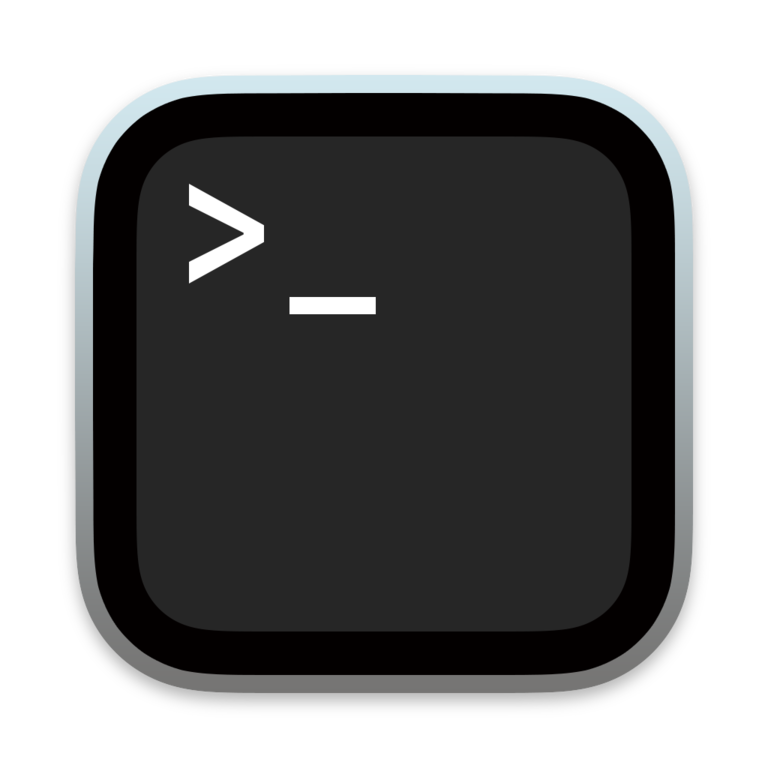

<div align="center">
    
    <h1>Chorizo CLI</h1>
    <p>A command-line interface for setting up and managing Chorizo instances. Simplify the process of configuring and deploying Chorizo with this powerful tool.</p>
</div>

---

# Table of Contents

- [Features](#features)
- [Usage](#usage)
- [Setup](#setup)
- [Contributing](#contributing)
  - [Developer Guidelines and Repository Setup](#developer-guidelines-and-repository-setup)

# Features

The Chorizo CLI offers a range of features to streamline the setup and management of Chorizo instances:

- **Automated Setup**: Quickly set up a new Chorizo instance with a single command.
- **Configuration Management**: Easily configure your Chorizo instance using the CLI.
- **Deployment**: Deploy your Chorizo instance to a Firebase project with a single command.
- **Version Management**: Update your Chorizo instance to the latest version with a single command.

# Usage

The Chorizo CLI is designed to be user-friendly and intuitive. Here are some common commands to get you started:

- `chorizo init`: Set up a new Chorizo instance.
- `chorizo update`: Update your Chorizo instance to the latest version.
- `chorizo deploy`: Deploy your Chorizo instance to Firebase.

For a full list of commands and options, run `chorizo --help`.

# Setup

To get started with the Chorizo CLI, follow these steps:

1. Install the CLI globally using npm:

```bash
npm install -g @chorizo/cli
```

2. Run the `chorizo init` command to set up a new Chorizo instance in your current directory.

3. Follow the prompts to configure your Chorizo instance.

4. Deploy your Chorizo instance to Firebase using the `chorizo deploy` command.

# Contributing

If you'd like to contribute to the Chorizo CLI, please follow
our [contributing guidelines](https://github.com/danieljancar/chorizo/blob/develop/.github/CONTRIBUTING.md).

## Developer Guidelines and Repository Setup

To set up the repository for development, follow these steps:

1. Clone the repository:

```bash
git clone https://github.com/danieljancar/chorizo.git
```

2. Install the dependencies:

```bash
cd chorizo
npm run install:all
```

3. To develop on the CLI, navigate to the `apps/cli` directory and run the following command:

```bash
npm install
```

4. To build the CLI, run the following command:

```bash
npm run build
```

5. To test the CLI, run the following command:

```bash
npm link
```

6. To run the CLI, use the `chorizo` command followed by the desired command.

For more information on development, see
the [developer setup guide](https://github.com/danieljancar/chorizo/blob/develop/README.md#developer-guidelines-and-repository-setup).
